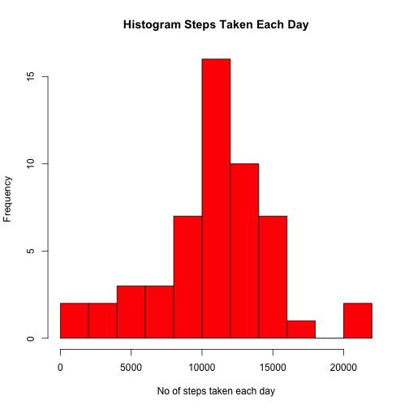
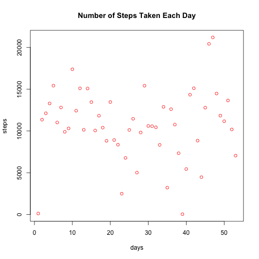
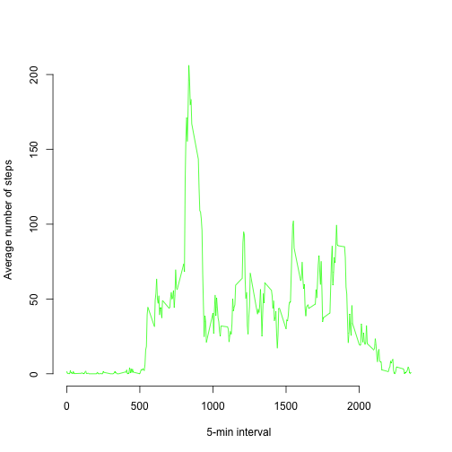
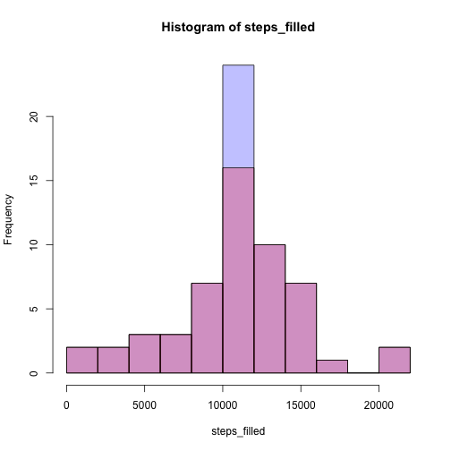
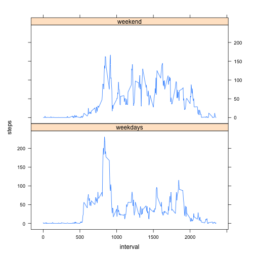

# Reproducible Research: Peer Assessment 1

## Loading and preprocessing the data


Download the data activity data file and unzip it in the current directory


```r
fileURL <- "https://d396qusza40orc.cloudfront.net/repdata%2Fdata%2Factivity.zip"
download.file(fileURL, destfile="repdata-data-activity.zip", method="curl")
unzip("repdata-data-activity.zip", "activity.csv")
```

### Load the data (i.e. read.csv())

Read the data from the file


```r
activity_data1 <- read.csv("activity.csv",header=TRUE, sep=",")
```

### Process/transform the data (if necessary) into a format suitable for your analysis

Convert the Date variables to a date class


```r
activity_data1$date <- as.Date(activity_data1$date,"%Y-%m-%d")
```

We ignore the missing values in the dataset


```r
activity_data2 <- na.omit(activity_data1)
```

## What is mean total number of steps taken per day?

### Make a histogram of the total number of steps taken each day

```r
steps <- tapply(activity_data2$steps, activity_data2$date, sum)
p1<-hist(steps, breaks=15, xlab="No of steps taken each day", col = "red", main = "Histogram Steps Taken Each Day")
```

 

We can also plot the total number of steps taken ech day 

```r
plot(steps, xlab="days", col = "red", main = "Number of Steps Taken Each Day")
```

 

### Calculate and report the mean and median total number of steps taken per day

Calculate the mean total number of steps taken per day

```r
mean_steps <- mean(steps)
```

The mean number of steps taken per day is 1.0766 &times; 10<sup>4</sup>

Calculate the median total number of steps taken per day

```r
median_steps <- median(steps)
```

The median number of steps taken per day is 10765

## What is the average daily activity pattern?

### Make a time series plot (i.e. type = "l") of the 5-minute interval (x-axis) and the average number of steps taken, averaged across all days (y-axis)


```r
steps_average <- tapply(activity_data2$steps, activity_data2$interval, mean)
plot(levels(factor(activity_data2$interval)), steps_average, type = "l", col = "green", 
     xlab = "5-min interval", 
     ylab = "Average number of steps", frame = F)
```

 
### Which 5-minute interval, on average across all the days in the dataset, contains the maximum number of steps?

```r
index_max_steps_average <- names(which.max(steps_average))
```
The 835th 5-minutes interval contains the maximum number of steps


## Imputing missing values
There are a number of days/intervals where there are missing values (coded as NA). The presence of missing days may introduce bias into some calculations or summaries of the data.

### Calculate and report the total number of missing values in the dataset (i.e. the total number of rows with NAs)

```r
no_missing_val <- sum(is.na(activity_data1))
```
A number of 2304 values are missing

### Devise a strategy for filling in all of the missing values in the dataset. The strategy does not need to be sophisticated. For example, you could use the mean/median for that day, or the mean for that 5-minute interval, etc.

We are using a strategy in which the missing value is substituted with the mean value fot that 5-min interval

```r
agr_data <- aggregate(steps ~ interval, data = activity_data1, mean, na.rm = TRUE)
activity_data_filled <- activity_data1
count <- 0
for (i in 1:nrow(activity_data1)){
  data_row <- activity_data1[i,]
  if (is.na(data_row$steps)){
    activity_data_filled[i,]$steps <- agr_data[agr_data$interval == data_row$interval,]$steps
    count <- count + 1
  }
}
```
A number of 2304 missing values have been replaced

### Create a new dataset that is equal to the original dataset but with the missing data filled in.
The new data set is saved in the variable called activity_data_filled

### Make a histogram of the total number of steps taken each day and Calculate and report the mean and median total number of steps taken per day. Do these values differ from the estimates from the first part of the assignment? What is the impact of imputing missing data on the estimates of the total daily number of steps?


```r
steps_filled <- tapply(activity_data_filled$steps, activity_data_filled$date, sum)
p2 <- hist(steps_filled, breaks=15, xlab="No of steps taken each day", col = "red", main = "Histogram Steps Taken Each Day")
```

 

Plot both histograms

```r
plot( p2, col=rgb(0,0,1,1/4))  # first histogram
plot( p1, col=rgb(1,0,0,1/4), add=T) # second histogram
```

 

Calculate the mean total number of steps taken per day

```r
mean_steps_filled <- mean(steps_filled)
```

The mean number of steps taken per day is 1.0766 &times; 10<sup>4</sup>. The previously calculated mean number of steps taken per day was 1.0766 &times; 10<sup>4</sup>

Calculate the median total number of steps taken per day

```r
median_steps_filled <- median(steps_filled)
```

The median number of steps taken per day is 1.0766 &times; 10<sup>4</sup>. The previously calcultaed median number of steps taken per day was 10765

## Are there differences in activity patterns between weekdays and weekends?

### Create a new factor variable in the dataset with two levels – “weekday” and “weekend” indicating whether a given date is a weekday or weekend day.
Add a new column to the activity_data_filled data frame and fill in with the weekdays

```r
activity_data_filled["days"] <- NA
activity_data_filled$days <- weekdays(activity_data_filled$date)
weekend_list <- c("Saturday","Sunday")
weekday_list <- c("Monday","Tuesday", "Wednesday", "Thursday", "Friday")
activity_data_filled$days[activity_data_filled$days %in% weekend_list] <- "weekend"
activity_data_filled$days[activity_data_filled$days %in% weekday_list] <- "weekdays"
```

### Make a panel plot containing a time series plot (i.e. type = "l") of the 5-minute interval (x-axis) and the average number of steps taken, averaged across all weekday days or weekend days (y-axis). The plot should look something like the following, which was creating using simulated data:

```r
agr_data_plot <- aggregate(steps ~ interval + days, data=activity_data_filled, FUN=mean)
library(lattice)
xyplot(steps ~ interval | days, data = agr_data_plot, aspect = 1/2, type = "l")
```

 

